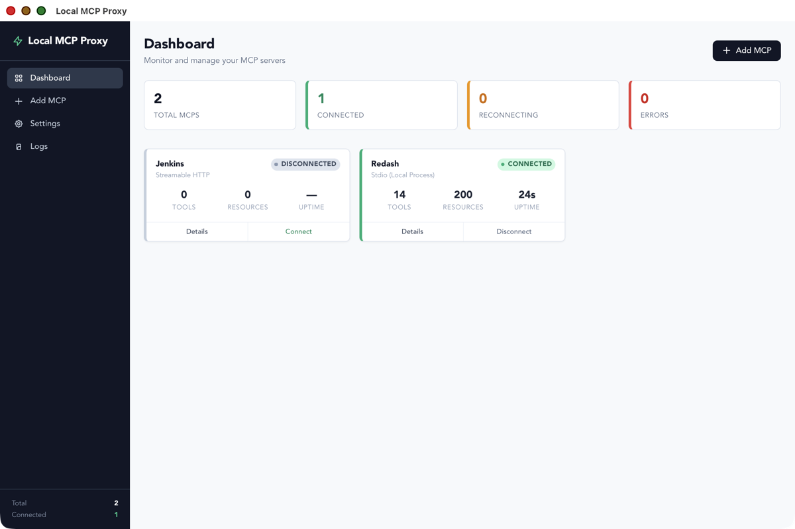
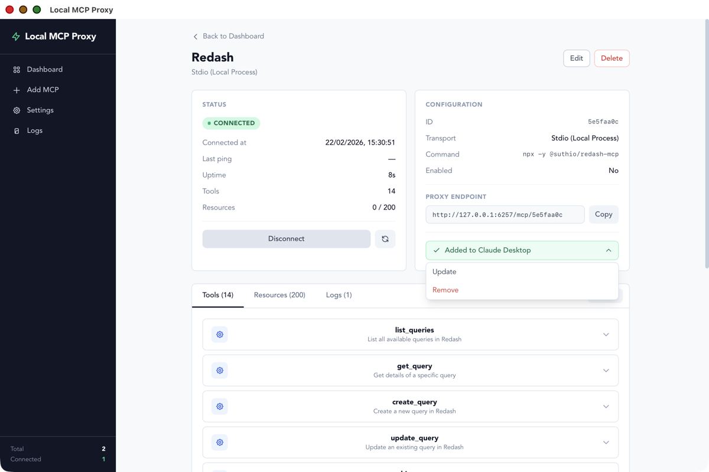
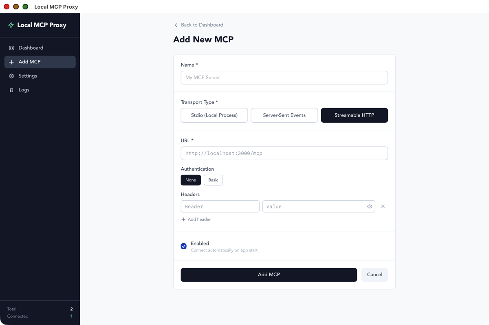

# Local MCP Proxy

> 🤖 Vibecoded - Built with AI assistance

A simple desktop app to manage multiple MCP (Model Context Protocol) servers in one place.

## Screenshots

### Dashboard
Monitor all your MCP servers at a glance — see connection status, tool/resource counts, and uptime.



### Server Details
Inspect a connected server's tools, resources, and logs. Copy proxy endpoints and push configs to Claude Desktop.



### Add Server
Configure new MCP servers with support for Stdio, SSE, and Streamable HTTP transports, custom headers, and authentication.



## What it does

- Add and manage multiple MCP servers
- Support for Stdio, SSE, and Streamable HTTP transports
- HTTP proxy for unified access to all your MCPs
- Real-time status monitoring and auto-reconnect
- View available tools and resources from each server

## Getting Started

```bash
# Install dependencies
npm install

# Run in development
npm run tauri dev

# Build for production
npm run tauri build
```

## Requirements

- Node.js (v18+)
- Rust (latest stable)

## HTTP Proxy

The app runs an HTTP proxy (default port 3000) for accessing your MCP servers:

- `GET /health` - Health check
- `GET /mcps` - List all MCPs
- `GET /mcp/:id/tools` - List tools
- `GET /mcp/:id/resources` - List resources
- `POST /mcp/:id/message` - Send message

## Tech Stack

- **Frontend**: Vue 3, TypeScript, Tailwind CSS
- **Backend**: Tauri 2, Rust, rmcp (official MCP SDK)

## License

MIT
